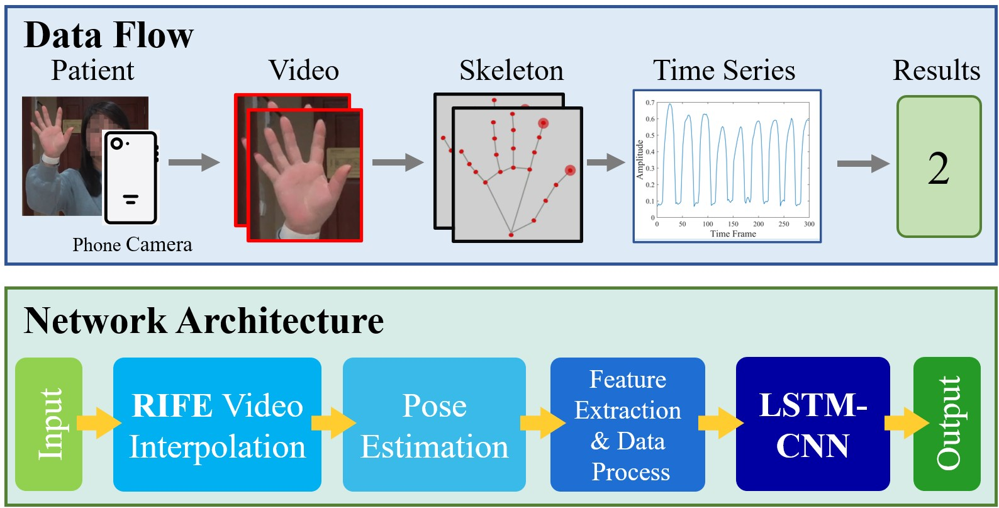
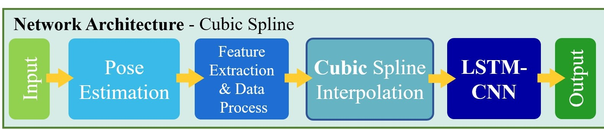
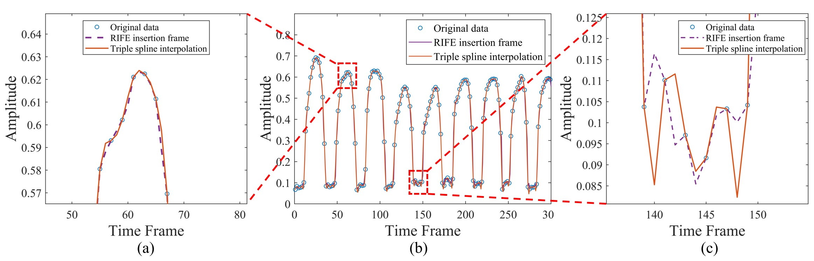

Now I'm studying at School of Electronics & Information, HDU (Hangzhou Dianzi University). 
And my latest GPA is 3.73/4.0(4.37/5.0) 5%.

## My Research Interests:

- MLsys (Machine Learning System)
- HPC (High Performance Computing)
- Computer Architecture
- Machine Learning
- Computer Vision

# 🔥 News

*Oct. 2022 - (Now)*: Preparing for **ASC** (Asian Supercomputer Community)

*July. 2022 - Sept. 2022*: **DGEMM**: Double Precision General Matrix Multiplication

- Using 9 ways to achieve Matrix Multiplication, including methods of **Cache-oblivious** (Recursive) and **Z-Morton**.
- Testing Matrix size is from 16 to 2048, the best function is **82% faster** than standard function.

# 📝 Publications 

*Nov. 2021 - Aug. 2022*: Medical Image Processing

- Led and designed the project of automatically evaluating finger tapping videos of Parkinson’s disease patients. 
- Developed LSTM-FCN based model to classify patients. The result has 83.7% accuracy, which in dataset of this paper defeats the state-of-the-art results in literatures. 
- Utilized: Pose estimation (Mediapipe Hands), RIFE algorithm (Time Series Interpolation), LSTM, FCN.

# 🎖 Honors and Awards

- *2021.09* The First Prize Scholarship, Award rate 5%
- *2022.9* Scholarship of Provincial Government, Award rate 5%

# 📖 Educations

- *2021.09 - 2024.06 (now)*, School of Electronics & Information, HDU, Bachelor's degree. 
- *2020.09 - 2021.06*, School of Mathematics, Hangzhou Dianzi University(HDU), Bachelor's degree. 

# 💻 Online Courses

- UC Berkeley CS267: Applications of Parallel Computers (Ongoing 17/26)
- UC Berkeley AI-Sys: Machine Learning Systems (Ongoing 3/11)
- CMU 15-213: Intro to Computer Systems (CSAPP),
- MIT 6.s081: Operating System Engineering
- THU: Data Structures
- Hung-yi Lee: Machine learning 2021
- Andrew Ng: Machine learning
- MIT 18.06: Linear Algebra

# 📈 Internships
